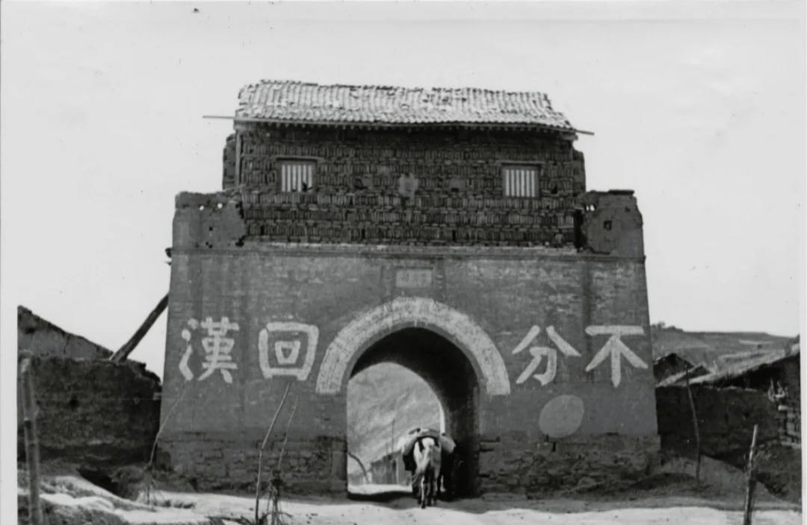

<br>

<br>
<br>

#### **Address**
McGuinn Hall <br>
Boston College <br>
140 Beacon Street <br>
Chestnut Hill, MA 02467 <br>
<br>

#### **Email**
[qianjl@bc.edu](mailto:qianjl@bc.edu)
<br>
<br>

<font size="2"> *(Photo: "No discrimination between the Hui Muslims and Han Chinese," slogan written on the East Gate of Haodian Village, Ningxia. Photo taken by Rev. Claude L. Pickens during his missionary trip to Northwest China in 1936.)*</font>


<br>
<br>
<br>
<center> 
<br>
<center> Copyright © Juan Qian, 2023-24
```{r setup, include=FALSE}
knitr::opts_chunk$set(echo = TRUE)

# Learn more about creating websites with Distill at:
# https://rstudio.github.io/distill/website.html

```

