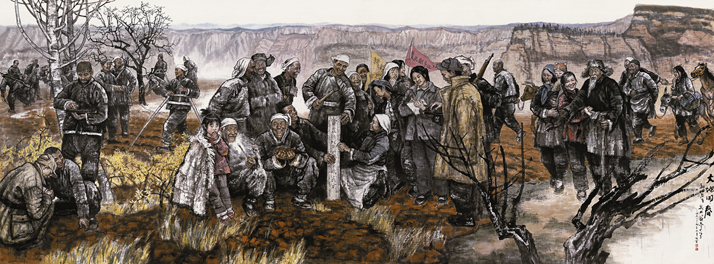

 

 
 

#### *Statebuilding by Campaign: The Making of Modern Chinese Bureaucracy, 1949-76*

 
**Abstract**: Between 1949 and 1976, the Chinese Communist Party (CCP) under Chairman Mao Zedong launched a series of chaotic, mass-mobilized campaigns to purge political dissidents and transform China’s socioeconomic landscape. In Statebuilding by Campaign, I explore (1) why there exist significant geospatial variations in the intensity and outcomes of these campaigns, and (2) how Mao-era campaigns shaped the norms, compliance, and responsiveness of the Chinese bureaucracy at the local level in both the short and long term. Drawing on an original dataset of Mao-era campaigns and extensive archival materials collected during my three-year fieldwork, this book provides a novel perspective on Mao-era campaigns through the lens of authoritarian statebuilding. Despite their apparent chaos and disorder, the campaigns increased Beijing’s capacity to gather information, enhanced local bureaucrats’ compliance with the central agenda, and enabled the central regime to oversee the behavior and performance of local bureaucrats. The book also examines the long-term impacts of Mao-era campaigns on the political norms of contemporary China, discussing whether modern-day policy implementation campaigns under Xi Jinping—such as the crackdown on official corruption and gang crimes—reflect the norms and practices of Mao-era campaigns.
 
 

 *(Figure: "The Land Reform Campaign." Traditional Chinese Painting by Xie Zhigao, 2009.)*
 
 
 

 
 

 Copyright © Juan Qian, 2023-24