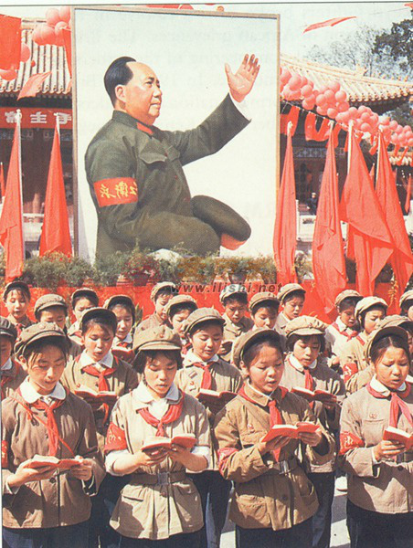

 

In the first three decades of the People’s Republic of China, Chairman Mao Zedong launched a series of mass-scale political campaigns to eradicate power contenders and transform China's socioeconomic structure. However, local officials sometimes lacked enthusiasm and were reluctant to fully comply with Mao’s demands to meet campaign targets. How did the Chinese regime under Mao motivate subordinate bureaucrats and improve their compliance and responsiveness to Beijing’s political agenda?

My dissertation answers this question by focusing on three major campaigns in Maoist China: the Land Reform (1949-54), the Anti-Rightist Movement (1957-59), and the Cultural Revolution (1966-76). I find that the Chinese regime adopted three strategies to induce greater compliance among subordinates. First, the regime tended to assign repressive tasks to officials who belonged to less trusted outgroup factions. Those officials, eager to signal their loyalty to the leader, would display greater enthusiasm in carrying out coercive tasks in the campaigns. Second, the regime tended to assign officials from rival backgrounds to the same locality and create factional tensions within the local authority. The distrust and mutual oversight among local elites created an incentive for them to diligently execute their assigned tasks to secure their positions. Third, the regime ensured campaign implementation by selectively mobilizing the masses. By allowing citizens to express their attitudes toward local officials to a limited degree, Beijing can mitigate the information asymmetry problem and impose greater oversight and pressure on the local authorities. In my dissertation, I use original historical data from in-depth archival research to illustrate the mechanism and consequence of political control in the Mao era.

 
 
 

 
 

 Copyright © Juan Qian, 2021