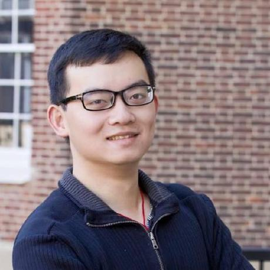

<br>

Welcome. My name is Jingyuan "Juan" Qian, and I am a PhD candidate in the [Political Science Department](https://polisci.wisc.edu/) at [University of Wisconsin-Madison](https://www.wisc.edu/). My major fields are comparative politics and methodology. 

My research focuses on the statebuilding of non-democratic regimes. My research agenda is consisted of three separate yet interrelated research questions: (1) how do rising autocrats induce and retain the compliance of their subordinates during power consolidation? (2) how do certain historical events shape contemporary behaviors and institutions in the long run? (3) in the specific context of China, when will tension arise between Party and state institutions? 

My dissertation project, titled "Statebuilding by Campaign," explores the role of Mao's mass-mobilized political campaigns in the 1950s and 1960s on the formation and consolidation of the Chinese party-state. I have been collecting and using a wide variety of archival data to understand how Mao's mass campaigns contributed to the CCP's statebuilding goals. Gratefully, my dissertation research has been supported by [NSF-APSA Doctoral Dissertation Improvement Grant](https://politicalsciencenow.com/meet-jingyuan-qian-2021-apsa-doctoral-dissertation-research-improvement-grantee/) and [APSA Hsueh International Fellowship Fund](https://connect.apsanet.org/centennialcenter/research-grants/).

Please find my [CV](cv.pdf) and a [short bio](about.html) here. 

<br>
<br>
<br>
<br>
<br>
<br>
<br>
<center> Copyright © Juan Qian, 2021

```{r setup, include=FALSE}
knitr::opts_chunk$set(echo = TRUE)

# Learn more about creating websites with Distill at:
# https://rstudio.github.io/distill/website.html

```

