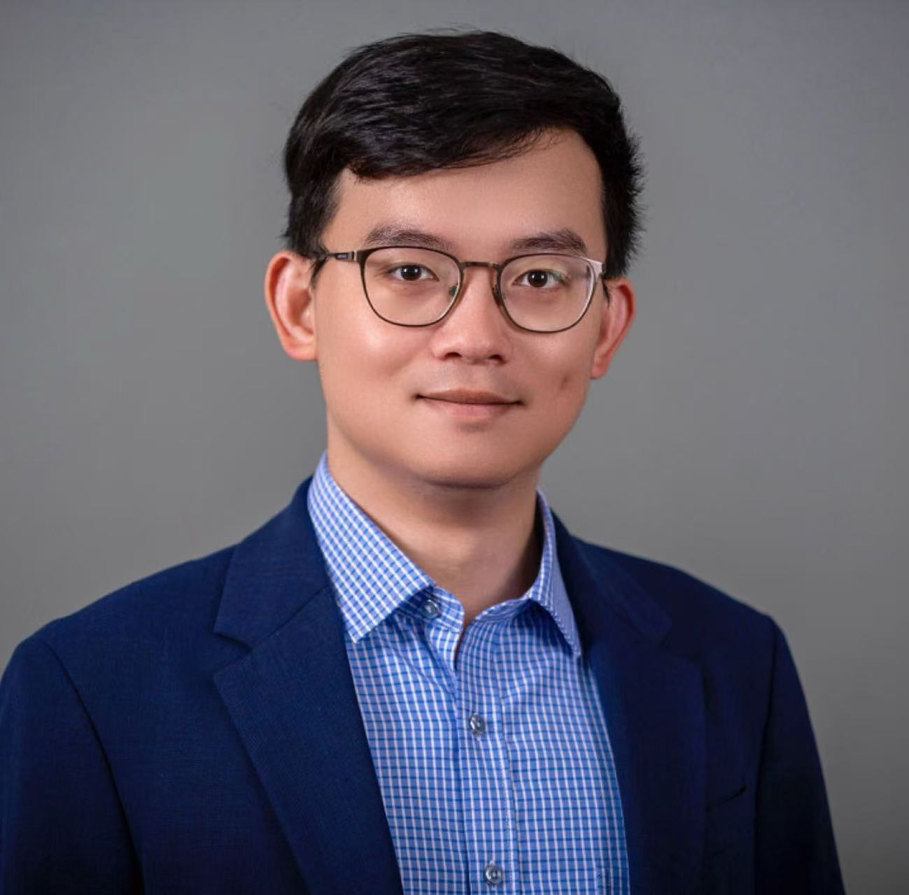

<br>

Welcome! I am an [Earl S. Johnson Postdoctoral Instructor in Political Science](https://mapss.uchicago.edu/directory/juan-qian) at the University of Chicago. I recently completed my Ph.D. in Political Science from the University of Wisconsin-Madison.

I am a comparative political scientist with a focus on China and East Asia. My research interests include statebuilding, elite and bureaucratic politics, and political violence in both historical and contemporary contexts. Central to my research is the *principal-agent problem* in authoritarian bureaucracy – how political leaders incentivize and maintain the compliance of subordinate bureaucrats in executing costly and undesirable tasks for the regime.

My dissertation-based book project, titled *[Statebuilding by Campaign: Regime Consolidation and Political Control in Modern China](dissertation.html)*, studies the various tactics and mechanisms employed by the Chinese regime under Mao Zedong to motivate and control subordinate bureaucrats during major political campaigns from 1949 to 1976. My research has won several prestigious grants and awards, including [NSF-APSA Doctoral Dissertation Research Improvement Grant](https://politicalsciencenow.com/meet-jingyuan-qian-2021-apsa-doctoral-dissertation-research-improvement-grantee/), [MPSA Pi Sigma Alpha Best Paper Award](https://www.mpsanet.org/professional-resources/awards/2024-award-recipients/), and [China Times Cultural Foundation Young Scholar Award](https://www.chinatimes.com/realtimenews/20211002000028-260405?chdtv). My recent papers has been published or is forthcoming in peer-reviewed journals including *[The China Quarterly](https://doi.org/10.1017/S0305741023000644)*, *[Ethnopolitics](https://doi.org/10.1080/17449057.2021.2001954)*, and *[Comparative Politics](https://doi.org/10.5129/001041524X17069685289697)*.

Please find my [CV](cv.pdf) here. 

<br>
<br>
<br>
<br>
<br>
<br>
<br>
<center> 
<br>
<center> Copyright © Juan Qian, 2023-24

```{r setup, include=FALSE}
knitr::opts_chunk$set(echo = TRUE)

# Learn more about creating websites with Distill at:
# https://rstudio.github.io/distill/website.html

```

