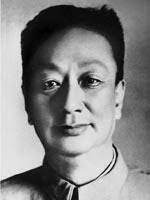

 

#### a. Peer-Reviewed Articles

1.["Campaign-Style Personnel Management: Task Responsiveness and Selective Delocalization during China's Anti-Corruption Crackdown,"](https://papers.ssrn.com/sol3/papers.cfm?abstract_id=4219395) with Feng Tang. 2023. *The China Quarterly*. 

**Very Short Summary:** During Xi's Anti-Corruption Campaign, provincial Party chiefs strategically appoint outside officials without local experience to govern cities with high-level corruption scandals. Their motivation for doing so is to (1) display allegiance to the Center's agenda; (2) increase hierarchical control and oversight over the corruption-affected bureaucracy. We then evaluate the effects of this appointment pattern.

 

2."[Historical Ethnic Conflicts and the Rise of Islamophobia in Modern China.](https://www.tandfonline.com/doi/abs/10.1080/17449057.2021.2001954?journalCode=reno20)" 2021. *Ethnopolitics*. 1-26.

**Very Short Summary:** Historical anti-Muslim sentiment can pass down inter-generationally and influence a society's contemporary attitudes towards Muslims. Chinese people who reside in places where [Hui Muslims rebelled in 19th century](https://en.wikipedia.org/wiki/Dungan_Revolt_(1862%E2%80%931877)) tend to hold significantly more negative views towards Muslims in contemporary era. Modern-day Chinese authorities in the 20th century often leveraged this sentiment to justify and strengthen political control.

 
 

#### b. Papers Under Review or Revision

1.["The Zeal of the Outgroup: Loyalty Signaling and Bureaucratic Compliance in China’s Anti-Rightist Campaign (1957–1958),"](https://www.researchgate.net/profile/Jingyuan-Qian/publication/357181235_The_Zeal_of_the_Outgroup_Loyalty_Signaling_and_Bureaucratic_Compliance_in_China's_Anti-Rightist_Campaign_1957-1958/links/6213b988f02286737cb2985d/The-Zeal-of-the-Outgroup-Loyalty-Signaling-and-Bureaucratic-Compliance-in-Chinas-Anti-Rightist-Campaign-1957-1958.pdf) with Steve Bai. (Revise and Resubmit, *Comparative Politics*)

**Very Short Summary:** During repressive campaigns, subordinate officials who belonged to disfavored outgroups or had a "stained" personal background tended to show greater fervency in executing the leader's coercive tasks in order to credibly signal their loyalty to the leader. We use a mass purge in 1957 to explore how this incentive could lead to geospatial variation in coercion.

 

#### c. Works in Progress (drafts available upon request)

1. “A Model of Repressive Campaigns and Bureaucratic Control.” 

2. “Grassroots Bureaucratic Incentives during China’s Crackdown on Organized Crime, 2018–2020,” with Feng Tang. 

3. “Diffusion of Revolution: Mass Mobilizations in China and Albania under Mao Zedong and Enver Hoxha,” with Mary Shiraef.

 
 
 
 

 
 

 Copyright © Juan Qian, 2023-24