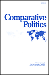
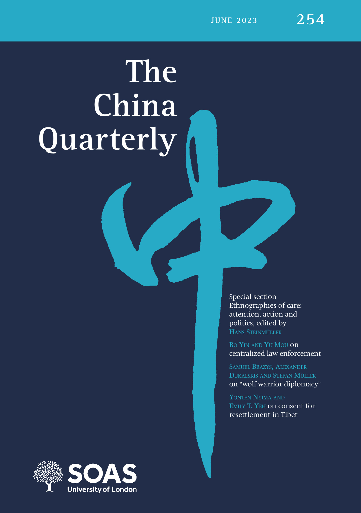

 

#### **a. Peer-Reviewed Articles**

3.["The Zeal of the Outgroup: Loyalty Signaling, Bureaucratic Compliance, and Variation of State Repression in Authoritarian Regimes,"](http://dx.doi.org/10.2139/ssrn.3988399) with Steve Bai. *Comparative Politics*, forthcoming.

**Synposis:** During repressive campaigns, subordinate officials who belonged to disfavored outgroups or had a "stained" personal background tended to show greater fervency in executing the leader's coercive tasks in order to credibly signal their loyalty to the leader. We use a mass purge in Mao's China to explore how this incentive could lead to geospatial variation in coercion.

 

2.["Campaign-Style Personnel Management: Task Responsiveness and Selective Delocalization during China's Anti-Corruption Crackdown,"](https://doi.org/10.1017/S0305741023000644) with Feng Tang. 2023. *The China Quarterly*. 

**Synposis:** During Xi's Anti-Corruption Campaign, provincial Party chiefs strategically appoint outside officials without local experience to govern cities with high-level corruption scandals. Their motivation for doing so is to (1) display allegiance to the Center's agenda; (2) increase hierarchical control and oversight over the corruption-affected bureaucracy. We then evaluate the effects of this appointment pattern.

 

1."[Historical Ethnic Conflicts and the Rise of Islamophobia in Modern China.](https://doi.org/10.1080/17449057.2021.2001954)" 2021. *Ethnopolitics* 22(1): 43-68.

**Synposis:** Historical anti-Muslim sentiment can pass down inter-generationally and influence a society's contemporary attitudes towards Muslims. Chinese people who reside in places where [Hui Muslims rebelled in the 19th century](https://en.wikipedia.org/wiki/Dungan_Revolt_(1862%E2%80%931877)) tend to hold significantly more negative views towards Muslims in contemporary era. Modern-day Chinese authorities often leveraged this sentiment to justify and strengthen political control.

 
 

#### **b. Working Papers (available upon request)**

3."Radicalization by Design: Factional Cleavages and Bureaucratic Compliance during China’s Land Reform Campaign (1949-54)"

**Synposis:** In this paper, I explore how autocrats incentivize subordinate officials to carry out undesirable or unpopular tasks by *leveraging factional divisions and power struggles* at the sub-national level. Using China's Land Reform Campaign (1949-54) as a case, I demonstrate how Beijing strategically create factional divisions within sub-national bureaucracy, intensify intra-group competition among local elites, and induce local officials' compliance with the Center's agenda.

 

2."Coercion, Capital, and Warlord Proto-States: Variation in Warmaking Propensity among Chinese Warlords, 1916–1928" (with [Siying Fu](https://sociology.wisc.edu/staff/fu-siying/))

**Synposis:** In a weak state, why are some sub-national actors more likely to engage in civil wars than others? In this paper, we use the Warlord Era (1916-28) in China to explore underlying determinants that shaped sub-national rulers' propensity to engage in conflicts. We show that a crucial factor was the warlords' relationship with the commercial elite --- local military rulers who were *more fiscally dependent* on the urban business community were less likely to engage in belligerent behavior.

 

1."The Anxiety of Embedded Officials: Local Connections and Bureaucratic Responsiveness during China's Campaign Against Organized Crimes (2018-20)" (with [Feng Tang](http://sir.uibe.edu.cn/szdw/zzxx/tf/index.htm))

**Synposis:** In this article, we analyze how local ties could impact an official’s compliance and responsiveness to policy priorities from higher authorities. We argue that, when the policy both has high priority and conflicts with local vested interests, locally embedded officials would face stronger pressure to display loyalty to their superiors and dispel suspicions of colluding with local elites targeted by the policy. We use the three-year Anti-Gang Campaign in China (2018-20) to validate our theory.

 
 
 
 

 
 

 Copyright © Juan Qian, 2023-24