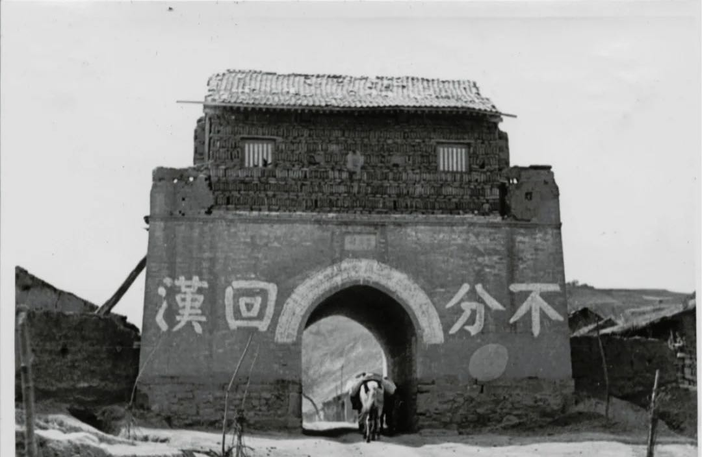

 

#### Peer-Reviewed Articles

"[Historical Ethnic Conflicts and the Rise of Islamophobia in Modern China.](https://www.tandfonline.com/doi/abs/10.1080/17449057.2021.2001954?journalCode=reno20)" 2021. *Ethnopolitics*. 1-26.

**Summary:** In this paper, I show that narratives of 19th-century historical conflicts between the Han Chinese and Muslims have been deployed to justify anti-Muslim sentiment and practices in modern and contemporary Northwest China. My study analyses Han Chinese narratives during and after the Northwest Muslim Rebellion -- the largest ethnic conflict in nineteenth-century China. The historical narratives about the rebellion have been passed down inter-generationally and have been reiterated and reconstructed to fuel contemporary bias against Muslims in the twentieth century and beyond. My study contributes to the debate of Chinese Islamophobia by revealing how narratives of ethnic conflicts could help legitimize hostility against Muslims in modern-day China.

**TL;DR:** Anti-Muslim sentiment can pass down inter-generationally. Chinese people who reside in places where Muslims rebelled in 19th century tend to hold significantly more negative views towards Muslims in modern and contemporary era.

 

#### Papers Under Review or Revision

1.["Campaign-Style Personnel Management: Task Responsiveness and Selective Delocalization during China's Anti-Corruption Crackdown,"](https://papers.ssrn.com/sol3/papers.cfm?abstract_id=4219395) with Feng Tang (Revise & Resubmit).

**Summary:** The Anti-Corruption Campaign launched by President Xi Jinping has been one of the most far-reaching bureaucratic overhaul in modern Chinese history. How has Xi’s anti-corruption crackdown shaped bureaucratic selection at sub-provincial level? In this paper, we find that the purge has influenced the provincial Party chiefs’ toleration of local embeddedness in their appointment of prefecture city leaders. While it is common for provincial Party chiefs to appoint locally embedded officials to govern localities without high-profile corruption cases, they tend to appoint non-local, unfamiliar officials to lead prefecture-level cities whose ex-leaders had recently been prosecuted for corruption. We argue that the provincial chiefs’ divergent attitudes toward local official embeddedness are driven by two factors: an upward-facing need for virtue signaling to their superiors, and a downward-facing incentive to strengthen hierarchical control. Using an original dataset of all Party secretaries from China’s 287 prefecture-level cities between 2013 and 2020, we find significant divergence in the local embeddedness of officials who are appointed to replace corrupt ex-leaders and those who fills the vacancies of transferred or retired predecessors. Our study sheds light on how Xi’s Anti-Corruption Campaign has reshaped the central-local relations and the logic of political control in China.

**TL;DR:** Provincial Party chiefs have an anti-local bias in the appointment of local leaders in cities that previously suffered from corruption scandals.
 

2.["The Zeal of the Outgroup: Loyalty Signaling and Bureaucratic Compliance in China’s Anti-Rightist Campaign (1957–1958),"](https://www.researchgate.net/profile/Jingyuan-Qian/publication/357181235_The_Zeal_of_the_Outgroup_Loyalty_Signaling_and_Bureaucratic_Compliance_in_China's_Anti-Rightist_Campaign_1957-1958/links/6213b988f02286737cb2985d/The-Zeal-of-the-Outgroup-Loyalty-Signaling-and-Bureaucratic-Compliance-in-Chinas-Anti-Rightist-Campaign-1957-1958.pdf) with Steve Bai. (Under Review)

**Summary:** One puzzle that haunts comparative politics scholars is the variation in the intensity of state coercion in authoritarian regimes. Why are some bureaucrats more heavy-handed in their use of force than others? In this paper, we propose a novel theory to explain the unevenness of bureaucratic compliance in coercive policy implementation. We argue that bureaucrats whose backgrounds are not trusted by the leader tend to implement repressive tasks more fervently in order to credibly signal their loyalty to the autocrat. We provide evidence for our theory using a unique dataset from China's Anti-Rightist Campaign (1957-1958), a coercive campaign launched by Chairman Mao Zedong against alleged critics of his rule. We find that officials who were former undercover partisans, a faction considered untrustworthy by Mao, tended to prosecute a larger fraction of alleged “rightists” in their jurisdictions and assign harsher penalties. Our study contributes to the existing literature by revealing the underlying motivation of coercive agents.

**TL;DR:** Subordinate officials who belonged to disfavored outgroups or had a "stained" background are under stronger pressure to behave more radically in executing the autocrat's repressive tasks to credibly signal their loyalty to the leader.

 

#### Works in Progress (drafts available upon request)

1. “A Model of Repressive Campaigns and Bureaucratic Control.” 

2. “Grassroots Bureaucratic Incentives during China’s Crackdown on Organized Crime, 2018–2020,” with Feng Tang. 

3. “Diffusion of Revolution: Mass Mobilizations in China and Albania under Mao Zedong and Enver Hoxha,” with Mary Shiraef.

 
 
 

 
 

 Copyright © Juan Qian, 2021