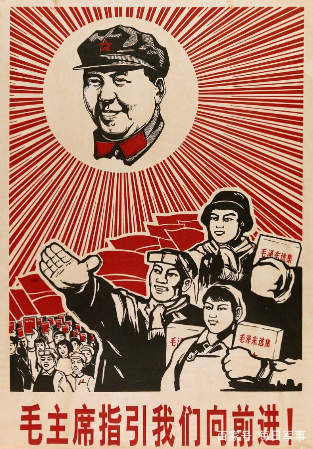

 

### Research Statement: Statebuilding, defined as collective choice
 Statebuilding is essentially the establishment and consolidation of authority. A ruler's authority, however, cannot arise out of thin air, but must depend on the continued consent and complicity of their subjects. In this sense, I understand statebuilding as the result of a series of collective decisions made by the ruler, subordinate elites, and ordinary citizens altogether. What determines the outcome of statebuilding, hence, is the ruler's ability to design proper incentives and restraints to induce the compliance of their subordinates to the newly established order.

My research agenda is built upon a strand of existing scholarly works. Works that directly inspire my research agenda include: [Buchanan and Tullock (1965)](https://www.econlib.org/library/Buchanan/buchCv3.html); [Huntington and Moore eds. (1970)](https://contemporarythinkers.org/samuel-huntington/book/authoritarian-politics-in-modern-society-the-dynamics-of-established-one-party-systems/); [Ostrom (1990)](https://www.cambridge.org/core/books/governing-the-commons/7AB7AE11BADA84409C34815CC288CD79); [Olson (1993)](https://datascience.iq.harvard.edu/files/gov2126/files/olson_1993.pdf); [Acemoglu and Robinson (2001)](https://economics.mit.edu/files/4121); [Bruce Bueno de Mesquita et al. (2003)](https://mitpress.mit.edu/books/logic-political-survival); [Ghandi and Przeworski (2007)](https://journals.sagepub.com/doi/10.1177/0010414007305817); [Magaloni (2008)](https://journals.sagepub.com/doi/10.1177/0010414007313124); [Egorov and Sonin (2011)](https://onlinelibrary.wiley.com/doi/abs/10.1111/j.1542-4774.2011.01033.x); [Svolik (2012)](https://www.cambridge.org/core/books/politics-of-authoritarian-rule/7F78A8828A5714F0BE74E44A90A44868); [Gehlbach and Simpser (2015)](https://onlinelibrary.wiley.com/doi/abs/10.1111/ajps.12122), among many others. 

What my research differs from previous works, however, is that I focus on the *emergence* and *stabilization* of autocracies at the early stages of power consolidation. Just like democratization can succeed or fail, *autocratization* can also yield diverging outcomes. Why some aspiring rulers successfully consolidate their rule, while others fall in disgrace, is the focus of my research program.

 
 

#### Dissertation: "Statebuilding by Campaign: Power Consolidation in Mao's China"

 **Summary**: In the first three decades of the People’s Republic of China, Chairman Mao Zedong and the Chinese Communist Party (CCP) launched a series of mass-mobilized, coercive political campaigns aiming to alter China’s socioeconomic structure and eliminate alleged challengers of the regime. How have these campaigns shaped China’s political trajectory? My dissertation project will analyze the short- and long-term effects of Mao’s coercive political campaigns on various political actors. More specifically, I hope to answer the following questions: how could participation in coercive campaigns affect an official’s loyalty and dependence on the ruler? Did harsher implementation of those campaigns make them more or less reliant on the ruler later in their careers? Furthermore, what role did ordinary citizens play during Mao’s mass-mobilized campaigns? Was their participation involuntary and passive, or could they somehow leverage those campaigns to restrain local officials and advance their collective interests? Could the experience of mass mobilization pass down inter-generationally and shape the political participation patterns of contemporary Chinese citizens? 

My dissertation will propose a theoretical framework for understanding those questions, and will focus on three major campaigns in Maoist China – the Land Reform (1949 – 54), the Anti-Rightist Campaign (1957 – 59), and the Cultural Revolution (1966 – 76) – to validate my theory.

 
 

#### Other Peer-Reviewed Articles

"Historical Ethnic Conflicts and the Rise of Islamophobia in Modern China." 2021. Forthcoming in *Ethnopolitics*. [[pdf]](https://www.tandfonline.com/doi/full/10.1080/17449057.2021.2001954)

**Summary:** This paper is adapted from my [undergraduate honors thesis in 2014](https://digitalcommons.macalester.edu/history_honors/27/), originally titled **"Too Far from Mecca, Too Close to Peking."** In this paper, I show that narratives of 19th-century historical conflicts between the Han Chinese and Muslims have been deployed to justify anti-Muslim sentiment and practices in modern and contemporary Northwest China. My study analyses Han Chinese narratives during and after the Northwest Muslim Rebellion -- the largest ethnic conflict in nineteenth-century China. The historical narratives about the rebellion have been passed down inter-generationally and have been reiterated and reconstructed to fuel contemporary bias against Muslims in the twentieth century and beyond. My study contributes to the debate of Chinese Islamophobia by revealing how narratives of ethnic conflicts could help legitimize hostility against Muslims in modern-day China.

**TL;DR:** Chinese people who reside in places where Muslims rebelled in 19th century tend to hold more negative views towards Muslims in modern and contemporary era.

 

#### Other Working Papers

"The Zeal of the Outgroup: Loyalty Signaling and Bureaucratic Compliance in China’s Anti-Rightist Campaign (1957–1958)" with Steve Bai. [[SSRN]](https://papers.ssrn.com/sol3/papers.cfm?abstract_id=3988399)

**Summary:** One puzzle that haunts comparative politics scholars is the variation in the intensity of state coercion in authoritarian regimes. Why are some bureaucrats more heavy-handed in their use of force than others? In this paper, we propose a novel theory to explain the unevenness of bureaucratic compliance in coercive policy implementation. We argue that bureaucrats whose backgrounds are not trusted by the leader tend to implement repressive tasks more fervently in order to credibly signal their loyalty to the autocrat. We provide evidence for our theory using a unique dataset from China's Anti-Rightist Campaign (1957-1958), a coercive campaign launched by Chairman Mao Zedong against alleged critics of his rule. We find that officials who were former undercover partisans, a faction considered untrustworthy by Mao, tended to prosecute a larger fraction of alleged “rightists” in their jurisdictions and assign harsher penalties. Our study contributes to the existing literature by revealing the underlying motivation of coercive agents.

**TL;DR:** Officials whose personal history before 1949 drew suspicion from Chairman Mao tended to behave more radically in Mao's political campaigns to openly display their loyalty.

 

"Who Succeed Corrupt Officials? Local Leadership Replacement during China’s Anti-Corruption Campaign (2013–2020)" with Feng Tang.

**Summary:** The Anti-Corruption Campaign, launched by President Xi Jinping in late 2012, has been one of the most far-reaching bureaucratic overhaul in modern Chinese history. How does the Anti-Corruption Campaign shape the pattern of personnel appointment at the local level? In particular, what type of officials are more likely to be appointed to replace exlocal leaders removed due to corruption? In this paper, we argue that a major selection criteria for successors to corrupt officials is local detachment. Because those officials are often tasked with eliminating their predecessor’s influence and strengthening local control for the upper-level authority, they are expected to be less embedded in local power dynamics and free from nepotism and conflict of interests. Using an original dataset of all Party secretaries and mayors from China’s 287 prefecture-level cities between 2013 and 2020, we show that officials who replace corrupt local leaders are much less likely to be chosen from the same locality compared to officials whose predecessors were transferred, promoted, or retired. In addition, successors to corrupt local leaders typically spend much shorter time serving in the locality in the past, and are more likely to have held previous positions in provincial- and central-level bureaucracies. Our study sheds new light on how Xi’s Anti-Corruption Campaign reshuffles the central-local relations in China.

**TL;DR:** When a local official was expelled due to corruption, the vacuum is more likely to be filled by successors who have little local connection.