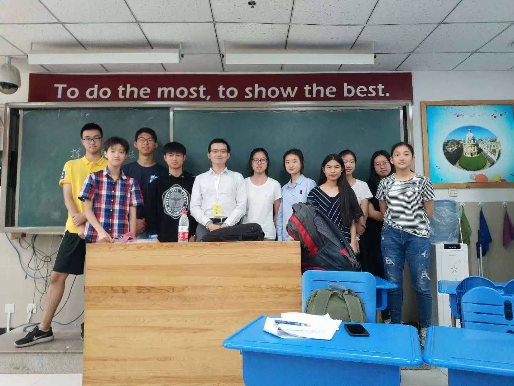

 

#### Teaching Political Economy to Chinese Undergrads

 In the summer of 2018, I taught at Beijing's [Veritas Academy](https://www.veritaschina.org), where I introduced basic concepts of political economy to an outstanding group of Chinese high schoolers and undergrads. My course covers basic tenets of political economy since Adam Smith and David Ricardo; prominent public choice thinkers such as Gordon Tullock, James M. Buchanan, and Lin Ostrom; and recent theoretical advances in statebuilding and democratization research. When teaching political economy, I consider myself a purveyor of knowledge, rather than a missionary or preacher of a religion.

I have made all lecture notes available for download (all lecture notes are written in Chinese). Please feel free to use or distribute it with proper attribution. Please let me know how I can make improvement in teaching this material.

 
 
 

[Lecture 1: Utility Theory; Demand and Supply; Price Theory](teaching_files/va1.pdf)
 
[Lecture 2: Theory of the Market](teaching_files/va2.pdf)
 
[Lecture 3: Corrections to Market Failure; Distribution of Public Goods; Coase Theorem](teaching_files/va3.pdf)
 
[Lecture 4: The Principle-Agent Problem; Theory of Bureacracy and Delegation](teaching_files/va4.pdf)
 
[Lecture 5: Public Choice Theories: Buchanan, Tullock, and Ostrom](teaching_files/va5.pdf)
 
[Lecture 6: Theories of State-building and Social Revolutions](teaching_files/va6.pdf)
 
[Lecture 7: Theories of Revolution, Democratization and Democratic Consolidation](teaching_files/va7.pdf)
